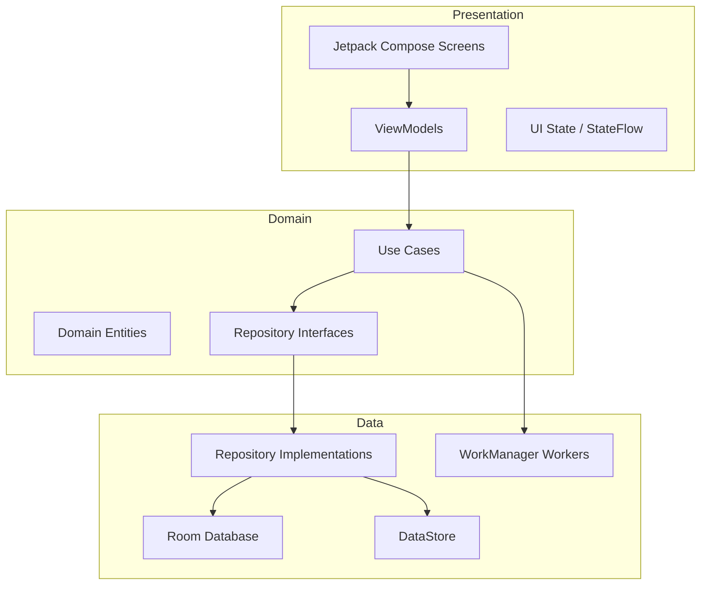
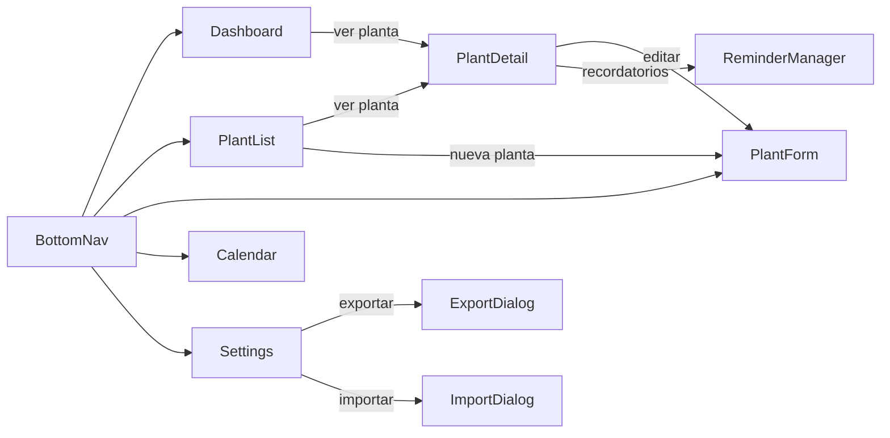

---
Verdy — App Android de Gestión de Plantas

## Stack tecnológico

- **Lenguaje:** Kotlin 2.x
- **UI:** Jetpack Compose + Material 3
- **DI:** Hilt
- **Persistencia:** Room (datos) + DataStore (preferencias)
- **Async:** Coroutines + Flow
- **Recordatorios:** WorkManager + NotificationManager
- **Fotos:** ActivityResultContracts (galería/cámara) + FileProvider
- **QR:** ZXing Embedded (`journeyapps:zxing-android-embedded`) para escanear; `zxing:core` para generar
- **Serialización:** Kotlinx Serialization (JSON) + java.util.zip (ZIP)
- **Tests:** JUnit 4 + Mockk + kotlinx-coroutines-test

---

## Arquitectura limpia — capas



---

## Estructura de paquetes

```
app/src/main/java/com/verdy/
├── di/
│   ├── DatabaseModule.kt
│   ├── RepositoryModule.kt
│   └── UseCaseModule.kt
├── domain/
│   ├── model/
│   │   ├── Plant.kt
│   │   ├── CareInfo.kt
│   │   ├── Reminder.kt
│   │   ├── ReminderFrequency.kt
│   │   ├── MaintenanceLog.kt
│   │   └── enums/  (PlantStatus, SunExposure, ReminderType, MaintenanceAction)
│   ├── repository/
│   │   ├── PlantRepository.kt
│   │   ├── ReminderRepository.kt
│   │   └── MaintenanceRepository.kt
│   └── usecase/
│       ├── plant/   (AddPlant, UpdatePlant, DeletePlant, GetPlant, GetAllPlants)
│       ├── reminder/ (AddReminder, UpdateReminder, GetTodayReminders, ToggleReminder)
│       ├── maintenance/ (RegisterMaintenance, GetHistory, GetLastCareDate)
│       └── transfer/ (ExportGarden, ImportGarden, GenerateQR, DecodeQR)
├── data/
│   ├── local/
│   │   ├── db/
│   │   │   ├── VerdyDatabase.kt
│   │   │   ├── entity/  (PlantEntity, ReminderEntity, MaintenanceLogEntity)
│   │   │   ├── dao/     (PlantDao, ReminderDao, MaintenanceLogDao)
│   │   │   └── converter/ (TypeConverters para enums y fechas)
│   │   └── datastore/
│   │       └── AppPreferences.kt
│   ├── repository/
│   │   ├── PlantRepositoryImpl.kt
│   │   ├── ReminderRepositoryImpl.kt
│   │   └── MaintenanceRepositoryImpl.kt
│   └── worker/
│       └── ReminderWorker.kt
├── presentation/
│   ├── theme/
│   │   ├── VerdyTheme.kt     (Material 3, colores naturaleza)
│   │   ├── Color.kt
│   │   └── Type.kt
│   ├── navigation/
│   │   ├── VerdyNavGraph.kt
│   │   └── BottomNavItem.kt
│   └── screen/
│       ├── dashboard/
│       │   ├── DashboardScreen.kt
│       │   └── DashboardViewModel.kt
│       ├── plants/
│       │   ├── list/   (PlantListScreen, PlantListViewModel)
│       │   ├── detail/ (PlantDetailScreen, PlantDetailViewModel)
│       │   └── form/   (PlantFormScreen, PlantFormViewModel)
│       ├── calendar/
│       │   ├── CalendarScreen.kt
│       │   └── CalendarViewModel.kt
│       └── settings/
│           ├── SettingsScreen.kt
│           └── SettingsViewModel.kt
└── VerdyApp.kt  (Application class)
```

---

## Modelo de datos (Room)

### Tabla `plants`
- `id` (PK autoincrement)
- `custom_name`, `common_name`, `scientific_name`
- `photo_uri`, `acquisition_date` (Long epoch days)
- `location`, `notes`
- `status` (HEALTHY / NEEDS_ATTENTION / RECOVERING)
- `watering_frequency_days`, `fertilizing_frequency_days`
- `fertilizer_type`, `water_amount_ml`
- `sun_exposure` (LOW / MEDIUM / HIGH)

### Tabla `reminders`
- `id`, `plant_id` (FK)
- `type` (WATERING / FERTILIZING / REPOTTING / PRUNING / CUSTOM)
- `custom_label`, `start_date`
- `frequency_type`, `frequency_value` (para EveryXDays)
- `is_active`, `work_manager_id`

### Tabla `maintenance_logs`
- `id`, `plant_id` (FK)
- `date` (Long epoch days)
- `type`, `action` (DONE / POSTPONED / IGNORED)
- `notes`

---

## Navegación



Navegación inferior con 4 tabs: **Inicio · Plantas · Calendario · Ajustes** y el FAB central para agregar.

---

## Flujos principales de usuario

**Agregar planta:**  
FAB → formulario (nombre, foto, cuidados) → guardar → regresa a lista con feedback Snackbar

**Ver recordatorios hoy:**  
Dashboard muestra cards de plantas pendientes → tap → acción (Realizado / Posponer / Ignorar) → actualiza historial y reagenda WorkManager

**Exportar datos:**  
Ajustes → Exportar → elige ZIP (plantas + fotos + JSON) o QR (datos compactos sin fotos) → comparte/guarda

**Importar datos:**  
Ajustes → Importar → escoge archivo o escanea QR → preview de datos → confirmar merge/reemplazar

---

## Sistema de recordatorios

`ReminderWorker` (WorkManager `PeriodicWorkRequest` o `OneTimeWorkRequest` según frecuencia):
1. Al guardar un `Reminder`, `ScheduleReminderUseCase` calcula la próxima fecha y encola un Worker
2. El Worker dispara una `NotificationCompat` con acciones directas ("Hecho", "Posponer")
3. La acción invoca un `BroadcastReceiver` que llama al `RegisterMaintenanceUseCase` y reagenda

---

## Paleta de colores (Material 3 — naturaleza)

- **Primary:** Verde salvia `#5B8A5F`
- **Secondary:** Tierra `#8B6E47`
- **Tertiary:** Musgo `#7A8C5B`
- **Background:** Crema `#FAFAF5`
- Soporte para **Dynamic Color** en Android 12+

---

## Exportación QR

- Serializar datos de plantas (sin fotos) a JSON → comprimir → Base64 → generar QR con `zxing:core`
- Si los datos superan ~2KB: mostrar aviso "Usa archivo ZIP para más de X plantas"
- Importar: escanear QR → decodificar → preview → confirmar

---

## Archivos de proyecto a crear

### Configuración Gradle
- [`settings.gradle.kts`](settings.gradle.kts)
- [`build.gradle.kts`](build.gradle.kts) (raíz)
- [`app/build.gradle.kts`](app/build.gradle.kts)
- [`gradle/libs.versions.toml`](gradle/libs.versions.toml) (version catalog)

### Manifiesto y recursos
- [`app/src/main/AndroidManifest.xml`](app/src/main/AndroidManifest.xml)
- [`app/src/main/res/`](app/src/main/res/) — strings, colores, ic_launcher

### Código fuente (~40 archivos Kotlin)
Todas las capas descritas en la estructura de paquetes.

### Tests
- [`app/src/test/`](app/src/test/) — Unit tests para use cases y ViewModels

---
